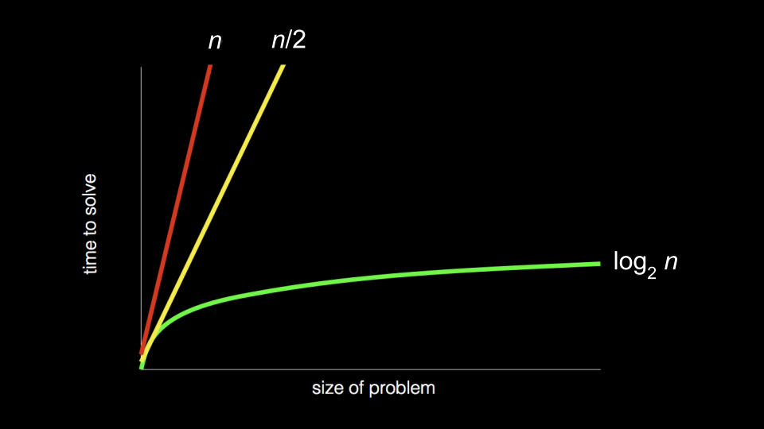
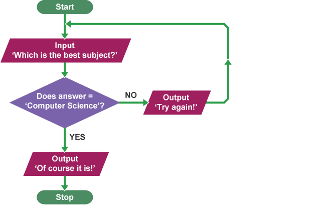

MIT License
Copyright (c) 2025 Emir Baha Yıldırım
Please see the LICENSE file for more details.

-------------------------------------------------------------------------------

# Algorithms

## What is an algorithm?

An algorithm can mean many things, here are some definitions from the official
CENG240 slides.

An algorithm is;
- a procedure or formula for solving a problem,
- a set of instructions to be followed to solve a problem,
- an effective method expressed as a finite listt of well-defined instructions
    for calculating a function
- step-by-step procedure for calculations.

These are all pretty good explanations of what an algorithm is. I think we can
combine these into one single sentence, from Harvard's CS50 Introduction to
Computer Science course:
- An algorithm is a step-by-step set of instructions to solve a problem.

This also gives the essence of computer science, too. Whatever you're doing is
to solve a problem, that's the main idea.

<details>
    <summary>A formal definition for the curious</summary>
    Starting from an initial sate and initial input (perhaps empty), the
    instructions describe a computation that, when executed, will proceed
    through a finite number of well-defined successive states eventually
    producing output and terminating at a final ending state.
</details>

I will try to explain you what an algorithm is by giving an example, this
example is from the
[Lecture 0 of CS50 2025](https://www.youtube.com/live/2WtPyqwTLKM).

Think about a phonebook, for the younger people who are reading this it's a
thick book of alphabetically ordered phone numbers of people living at a
certain area and it may also include phone numbers of local shops and all. Now,
you want to find the phone number of John Harvard, an old friend of yours. What
are the ways you can search the book?

The first one that comes to mind is to through all pages one-by-one from start
to either finish or John Harvard, if he's in the book. This is a correct
algorithm, because if he's in the book you will definitely (if you're reading
carefully) find him; however, this is pretty inefficient isn't it? Let's sa
that there are 1000 pages in total. In every page we have very tiny lines of
phone numbers. Let's try a different algorithm, in which we go 2 pages at a
time, this should take half the time since we're going twice as fast, but is
this algorithm correct? No, right, because John Harvard could be sandwiched
between two pages when we come to 'J'. Even though this algorithm is twice as
fast as our previous algorithm, it's not completely correct. Maybe we could go
back and check again when we see that we've come to 'K'. All and all, these are
pretty bad algorithms compared to the one I'll tell you right now.

Imagine opening that book right from the middle, we're now seeing a page with
the letter 'M'. Now, effectively we've divided this phonebook into two
different parts. Which side should John Harvard be, if he's in the book? Left
side, right? Then, we can get rid of the right side completely, since we're
100% sure that he cannot be at that side. Now, we have a 500 page problem. Do
it again. Split it right in the middle, you will probably see the letter 'G'.
We've overshot, John Harvard should be at the right side, so let's get rid of
the left side of the book. Do it again and again and again, making sure which
side he should be on. At the end you should be left with a single page, in
which John Harvard is on that page (if he's in the book at all).

That's what an algorithm is, a set of very carefully put instructions that
helps us solve very real problems.

Now, let's compare those algorithms, shall we? We are going to compare their
worst-case-scenario performances, because we could be looking for someone with
a name starting with the letter 'Z'.

First algorithm is a linear one, right? If the Harvard and MIT from down the
road merged their phonebooks together, they would have a 2000-page phonebook,
and it could take us twice as fast to find that person. Let's call that graph,
n. Second algorithm is also a linear one, because even if we were going twice
as fast, every 2 pages added to the book would add one more step to our
algorithm, making its graph n/2. This way of trying to understand the average
speed of algorithms is called the Big-O Notation (e.g., O(n), O(n/2))

The third algorithm, however, is different. Its graph's shape is not linear,
it's fundamentally different. If you remember your logarithms, you should
recognize that graph as the graph of log base 2 of n. Adding 2 or 100 pages
doesn't change our runtime even a bit. Yes, it's not a constant function, but
it's significantly better than both of those algorithms. The Big-O Notation of
this algorithm would be O(log2(n)).

[^1.1.1]

If we were to compare a case where we are looking for someone with their name
starting with the letter 'Z', in a thousand-page phonebook, first algorithm
would take 1000 steps but it would find it, the second algorithm would take
~500 steps but it has a 50/50 chance of not finding it; however, the third
algorithm would only take about 10 steps.

-------------------------------------------------------------------------------

## Valid Operations in Algorithms

Let's write the third algorithm in something called 'pseudocode'.

<details>
    <summary>What is pseudocode</summary>
    A pseudocode is not a formal language or something like that. It's a way of
    creating an algorithm in understandable but precise human language without
    the burden of writing it out in syntax of programming languages.
</details>

```markdown
01. Pick up phonebook
02. Open the middle of book
03. Look at page
04. If person is on the page
05.     Call person
06. Else if person is earlier in book
07.     Open to middle of left half of book
08.     Go back to line 3
09. Else if person is later in book
10.     Open to middle of right half of book
11.     Go back to line 3
12. Else
13.     Quit
```

There are 3 types of valid operations in algorithms: sequentials, conditionals,
and iteratives. Sequentials are simple, well-defined tasks, and they're usually
declarative sentences. Conditionals are checks done by asking questions to the
code, and acting by the result of that question. Iteratives are looping
instructions that repeat a set (or subset) of instructions. Let's identify
these in my pseudocode.

From our definitions, line 1 must be a sequential operation. It's a
well-defined declarative sentence, in which the user asks the machine to pick
up the phonebook. Same thing applies to the second and third lines, they ask
the machine to do some well-defined task, open the middle of the book or look
at page. Line 4, however, is a conditional. It checks whether the person is on
the page that we've looked on line 3. The extra space on the line 5 is
intentional, they specify what the machine should do if the question asked in
the conditional is correct. In our case, if the person is on the page the
machine should call the person, if not it would continue with the next
conditional, else if person is earlier in book in our case. It checks whether
the person we're trying to call is earlier in the book and then if that's
correct it does the indented part of the code, in which it opens to middle of
the left half of the book, and goes back to line 3. Line 8 is a perfect example
of iterative operation, if the conditional is correct, it would go back to the
line 3 and iterate over the rest of the code again. Same thing applies for the
'code block' between the lines 9 and 11. If all three conditionals, the
questions we ask the computer to check, fail, we have a last case scenario, an
else case, in which we ask the computer to quit searching so it doesnt' go into
an infinite loop.

If you missed anything up there, I strongly urge you to watch the
[video](https://www.youtube.com/live/2WtPyqwTLKM) I've mentioned before. Prof.
David J. Malan is an amazing professor, he explains everything so well.

-------------------------------------------------------------------------------

## Ways of Describing Complex Algorithms

First of all, the best way of describing an algorithm is the one you understand
the best. Putting that aside there are some popular ways of doing it.

1. **Using Pseudocode**

Pseudocoding is very popular among developers, because it's very easy to
understand and make other people understand. It's really easy to write, you
just take a pen and paper and write the instructions in the order of execution,
just like what David's pseudocode of searching a name in a phonebook.

2. **Using Flow-Charts**

This is, again, very popular among developers, because it's easy to follow and
see the outcomes of every possibility. This might take a bit more time than
writing pseudocode, but you have more tools in your shed. You can use colors
for different operations, for example.

[^1.3.1]

In this funny example, the algorithm asks for the user's favorite subject. If
They don't say "Computer Science", the algorithm prints out "Try again.!". If
they do say "Computer Science" the algorithm prints out "Of course it is!" and
ends the program.

-------------------------------------------------------------------------------

# Programming Languages

## The World of Programming Languages

If you remember week 0, I've talked about low/high level programming languages.
I have intentionally mislead you there, sorry. Assembly is actually considered
to be a low-level programming language, it's only 'high' level compared to pure
machine code, and basically nothing else.

### Levels of Programming Languages

The levels of programming languages are not like the levels of a game. It's
actually tells you how abstracted that language is. It's not a definite thing,
mind you, it's only a way of understanding how abstract that language is
compared to pure machine code.

-------------------------------------------------------------------------------

#### Low-Level Programming Languages

A low-level programming language, like Assembly of x86_64, is a programming
language that is very close to the machine code. It has very little abstraction
from the machine code, and it is very hard to read for humans. It is very
efficient, however, because it is very close to the machine code, thus not that
abstract compared to high-level programming languages. It is usually used in
operating systems, embedded systems, and other performance critical
applications. It is also used in reverse engineering, because it is very easy
to understand how the machine works with it.

<details>
    <summary>A "Simple" Example of Assembly (x86_64) Code</summary>

```asm
section .data
    ; Define our message and its length
    msg db "Hello, World!", 0x0A ; 0x0A is the ASCII code for newline
    len equ $ - msg             ; Calculates the length of the message

section .text
    global _start               ; Entry point for the linker

_start:
    ; syscall for sys_write (write to file descriptor)
    mov rax, 1                  ; sys_write syscall number
    mov rdi, 1                  ; File descriptor 1 (stdout)
    mov rsi, msg                ; Address of the message string
    mov rdx, len                ; Length of the message
    syscall                     ; Execute syscall
    ; syscall for sys_exit (exit program)
    mov rax, 60                 ; sys_exit syscall number
    mov rdi, 0                  ; Exit code 0 (success)
    syscall                     ; Execute syscall
```
<details>
        <summary>Disassembly of the Above Code for Nerds</summary>

```asm
0:  48 c7 c0 01 00 00 00    mov    rax,0x1
7:  48 c7 c7 01 00 00 00    mov    rdi,0x1
e:  48 8b 34 25 00 00 00    mov    rsi,QWORD PTR ds:0x0
15: 00
16: 48 8b 14 25 00 00 00    mov    rdx,QWORD PTR ds:0x0
1d: 00
1e: 0f 05                   syscall
20: 48 c7 c0 3c 00 00 00    mov    rax,0x3c
27: 48 c7 c7 00 00 00 00    mov    rdi,0x0
2e: 0f 05                   syscall
```
</details>

Don't worry, you probably will never actually deal with Assembly code ever in
your life. I've put this here just as an example.
</details>

-------------------------------------------------------------------------------

#### High-Level Programming Languages

Now, that you know what low-level programming languages are, you can probably
guess what kind of a programming language would be considered high-level. There
are 2 types of high-level programming languages: compiled, interpreted.

-------------------------------------------------------------------------------

##### Compiled Languages

Imagine you're writing a complex novel in English. Before anyone can read it,
you need to translate the entire book into another language, say, French. This
translation process meticulous; every word, every sentence, every grammatical
rule must be perfectly converted. Once the whole book is ttranslated, it
becomes a standalone French novel. You can then distribbute this French
version, and anyone who speaks French can read it directly, quickly, without
needing the original English text or the translator present.

This is very similar to how a compiled programming language works. When you
write code in a compiled language (e.g., C, C++, or Go), you first run it
through a special program called a compiler. The compiler's job is to take your
human-readable source code and translate the entire thing into a
machine-readable format, typically called machine code or an executable file.
This executable file is then self-contained and can be run directly by your
computer's processor.

The compilation process involves several complex steps, and you don't have to
know it for this course, but I'll give you anyway.

<details>
    <summary>Steps of the Compilation Process</summary>

1. **Lexical Analysis:** Breaking your code into tokens (like words and
    symbols)
2. **Syntax Analysis:** Checking if the code follows the language's grammar
    rules.
3. **Semantic Analysis:** Ensuring the code makse sense logically.

4. **Code Generation:** Producing the machine code.

5. **Optimization:** Making the machine code run faster or use less memory.
</details>

Once compiled, the resulting executable program can be run over and over again
without needing the compiler or the original source code. Think of it as a
pre-built application ready to go.

<details>
    <summary>A Simple Example in a Compiled Language (C99)</summary>

A hello world program in C:
```c
#include <stdio.h>

int main() {
    printf("Hello, World!");

    return 0;
}
```

It's corresponding Assembly (x86_64) code:
```asm
section .data
    hello db 'Hello, World!', 0

section .text
    global _start

_start:
    ; write the string to stdout
    mov rax, 1          ; syscall: write
    mov rdi, 1          ; file descriptor: stdout
    mov rsi, hello      ; pointer to the string
    mov rdx, 13         ; length of the string
    syscall

    ; exit the program
    mov rax, 60         ; syscall: exit
    xor rdi, rdi        ; status: 0
    syscall
```
</details>

-------------------------------------------------------------------------------

##### Interpreted Languages

Now, let's consider a different scenario for our novel. Instead of translating
the entire book upfront, imagine, again, you have an English novel, and someone
who only speaks French wants to read it. You could sit with them, and a human
interpreter could read the English text line by line, translating each sentence
into French aloud as they go. The reader gets the French version immediately
after you speak each sentence, but the interpreter needs to be present and
active throughout the entire reading process, and the original English book is
always needed.

This is analogous to an interpreted programming language. When you write code
in an interpreted language (e.g., Python, JavaScript, or Ruby), there isn't a
separate, upfront compilation step that creates a standalone executable.
Instead, another program called an interpreter reads your source code line by
line (or instruction by instruction) and executes it directly.

The interpreter essentially performs the translation andd execution
simultaneously. Each time you run an interpreted program, the interpreter
processes the source code from scratch. This means you always need the
interpreter installed on the computer where you wnat to run the program, along
with the original source code itself. The execution happens on the fly as the
interpreter works through the code.

<details>
    <summary>A Simple Example in an Interpreted Language</summary>

A hello world program in Python.
```python
print("Hello, World!")
```

Yes, that's it. Literally. Also, it would work in a `.py` file and the Python
interpreter itself.
</details>

-------------------------------------------------------------------------------

# References

[^1.1.1]: [CS50 - 3 Algorithms Compared](https://cs50.harvard.edu/x/notes/0/cs50Week0Slide141.png)
[WayBack Machine](https://web.archive.org/web/20250601073812/https://cs50.harvard.edu/x/notes/0/cs50Week0Slide141.png)

[^1.3.1]:  [BBC - Example Algorithm Flowchart](https://www.bbc.co.uk/bitesize/guides/z3bq7ty/revision/3)
[WayBack Machine](https://web.archive.org/web/20250320171857/https://bam.files.bbci.co.uk/bam/live/content/zs96tfr/large)
